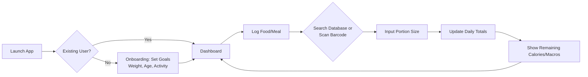
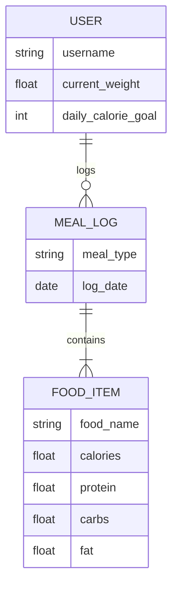
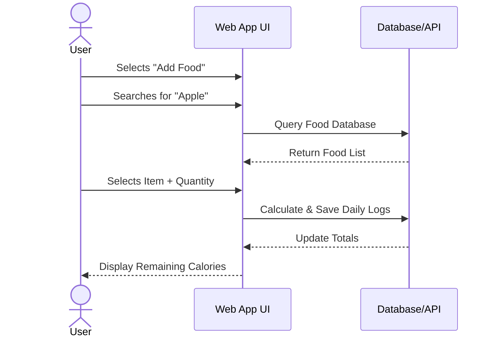

# Calorie Tracker App – System Architecture

## Project Title
Calorie Tracker App

---

## Domain
Health and Nutrition

---

## Problem Statement
Users often struggle to accurately track their daily calorie intake using manual methods. This system provides a digital solution that allows users to record meals, calculate calories automatically, and monitor nutritional habits over time.

---

## Individual Scope
The system will be developed by a single developer using a modern web stack consisting of Next.js, TypeScript, Tailwind CSS, and PostgreSQL. The architecture is intentionally simple while still demonstrating full end-to-end system components.

---

# C4 Architectural Diagrams

## 1. User Journey Diagram

This diagram shows a person's experience during one session of using progressive web app to track their calories.

## 2. Entity Relationship Diagram

This diagram shows the structure and relationship between entities. Please not this diagram is subject to change as system development progresses.

## 3. Sequence Diagram

This diagram shows how users interact with the calorie tracking system and how the system connects to external components.

