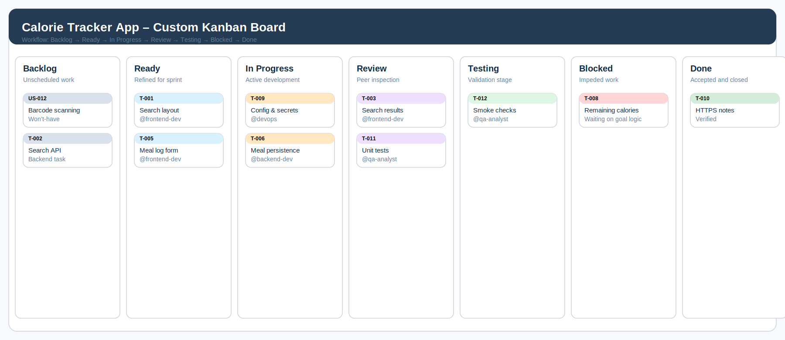

# Calorie Tracker App – Kanban Board Explanation

## 1. Definition of Kanban
A Kanban board is a visual work-management system used to represent the flow of tasks from initiation to completion. Work items are displayed as cards and moved across columns that correspond to the state of delivery. The purpose of the board is to make work visible, expose bottlenecks early, and support continuous delivery.

## 2. Project Board Overview

The Calorie Tracker App uses a customized Kanban board derived from the selected GitHub Project template. The board is intended to track requirements-driven work items from the Agile backlog through implementation, validation, and completion.

*Figure 1: Custom Kanban board showing the project workflow from backlog to completion.*

## 3. Board Structure

| Column | Function | Typical Items |
|---|---|---|
| **Backlog** | Stores approved but unscheduled work. | New user stories, technical tasks, deferred items. |
| **Ready** | Holds work that has been refined and is ready for execution. | Sprint-selected stories with defined acceptance criteria. |
| **In Progress** | Indicates active development. | Tasks currently being implemented by an assignee. |
| **Review** | Supports formal inspection before acceptance. | Completed work awaiting review of quality or documentation. |
| **Testing** | Confirms that the work satisfies the stated requirement. | Functional tests, regression checks, acceptance verification. |
| **Blocked** | Identifies work that cannot proceed due to a dependency or defect. | Tasks waiting on clarification, data, or technical resolution. |
| **Done** | Records accepted and completed work. | Verified user stories, closed tasks, approved deliverables. |

## 4. Work-in-Progress Policy

Work-in-progress limits are applied to preserve focus and prevent congestion.

- **In Progress:** maximum of 3 tasks per contributor.
- **Review:** maximum of 2 tasks.
- **Testing:** maximum of 2 tasks.
- **Blocked:** no numerical limit, but every blocked item must include a reason and an owner responsible for resolution.

These limits are intended to keep work moving steadily rather than allowing too many partially completed items to accumulate.

## 5. How the Board Visualizes Workflow

The board visualizes workflow by placing each item in a single, clearly defined state. As the task matures, the card is moved from left to right across the board.

1. The item is created in **Backlog**.
2. The item is refined and moved to **Ready**.
3. Development begins in **In Progress**.
4. The completed work is checked in **Review**.
5. The result is validated in **Testing**.
6. If an issue prevents continuation, the card moves to **Blocked**.
7. Once accepted, the item is moved to **Done**.

This progression makes the current status of each task immediately visible to all stakeholders.

## 6. Relationship to Agile Principles

The board supports Agile delivery in several ways:

- **Transparency:** all work items remain visible on the board.
- **Adaptability:** priorities can be adjusted without redesigning the workflow.
- **Incremental delivery:** the team can complete and release small sets of work continuously.
- **Feedback-driven improvement:** review and testing stages provide opportunities to correct defects before completion.
- **Predictable flow:** WIP limits help the team avoid bottlenecks and maintain throughput.

## 7. Alignment with Project Requirements

The board structure directly supports the functional and non-functional requirements defined earlier in the documentation.

- **Search, meal logging, and dashboard updates** are tracked as feature work.
- **Validation and persistence tasks** are tracked alongside the core user stories to protect data integrity.
- **Testing and review** columns ensure that acceptance criteria are checked before tasks are closed.
- **Blocked tracking** ensures that dependency-related delays are visible rather than hidden.
- **Security and deployment tasks** remain on the same board as feature work, which reinforces the principle that technical readiness is part of product delivery.

## 8. Issue and Assignment Conventions

Each board card should correspond to a GitHub issue linked to a user story or implementation task. The issue should include:

- the story ID,
- the linked functional requirement,
- the acceptance criteria,
- the assigned collaborator using an `@mention`,
- the appropriate label set,
- and the current board column.

This convention ensures that the project board is not only visual but also traceable to the documented requirements.

## 9. Conclusion

The customized Kanban board provides a practical and disciplined method for managing the Calorie Tracker App. It improves visibility, limits work overload, and supports the project’s Agile workflow from planning through verification.

