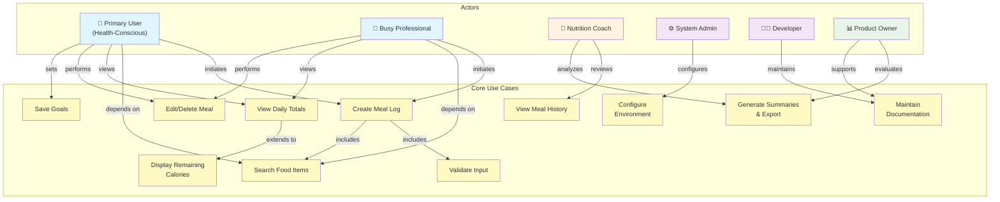

# Calorie Tracker App – Use Case Diagram & Model

## 1. Use Case Diagram

## 2. Detailed Actor Descriptions

### Primary User (Health-Conscious Individual)
- **Role:** Core system consumer who logs meals and tracks progress toward nutrition goals
- **Concerns:** Speed, accuracy, simplicity, immediate feedback on daily totals
- **Interactions:** Meal logging, viewing summaries, editing entries, setting goals
- **Success Metrics:** Complete meal entry in <1 minute; see updated totals immediately

### Busy Professional
- **Role:** Generalization of Primary User with emphasis on time constraints
- **Concerns:** Minimal steps, quick access, low friction to consistent use
- **Interactions:** Fast meal entry, search with filters, recent meal shortcuts
- **Success Metrics:** 90% of meals logged in ≤3 steps; weekly active engagement

### Nutrition Coach / Wellness Advisor
- **Role:** Reviews historical logs to provide guidance and identify dietary patterns
- **Concerns:** Accurate summaries, clear trends, exportable data for client review
- **Interactions:** View history, generate reports, analyze trends
- **Success Metrics:** Review week of logs in <5 minutes; export matches stored entries

### System Administrator / Host Operator
- **Role:** Deploys and monitors the application in production
- **Concerns:** Stable deployments, secure configuration, reliable uptime
- **Interactions:** Environment configuration, deployment automation, monitoring
- **Success Metrics:** Documented setup works on first try; secrets remain secure

### Developer / Maintainer
- **Role:** Builds, updates, and supports the codebase
- **Concerns:** Clean architecture, testability, documentation quality
- **Interactions:** Code organization, API maintenance, updating docs
- **Success Metrics:** Bugs fixed quickly; features remain modular; docs stay current

### Future Product Owner / Potential Client
- **Role:** Evaluates system for post-semester expansion potential
- **Concerns:** Extensibility, maintainability, feature roadmap readiness
- **Interactions:** Reviews summaries, evaluates architecture, plans enhancements
- **Success Metrics:** System can support future features without major redesign

---

## 3. Use Case Relationships Explained

### Inclusion Relationships (→ includes)
**Create Meal Log → Search Food Items**
- Every meal entry depends on finding the correct food item from the database
- Ensures consistency: search always happens before calorie calculation
- Supports FR-01 and FR-07 together

**Create Meal Log → Validate Input**
- Validation occurs as part of meal submission, not as a separate process
- Prevents invalid entries before they reach the database
- Addresses FR-12 (validation messages)

### Extension Relationships (→ extends to)
**View Daily Totals ⟶ Display Remaining Calories**
- Remaining calories appear as an extension of the totals view
- Optional detail that appears when a user has set a goal
- Ties FR-03 and FR-04 together in a natural workflow

### Generalization Relationships (→ initiates)
**Busy Professional generalizes Primary User**
- Both follow the same core meal logging flow
- Busy Professional emphasizes speed; Primary User emphasizes simplicity
- Both can perform the same use cases but with different performance expectations

---

## 4. Alignment with Stakeholder Concerns

| Stakeholder | Key Concern | Addressed By Use Cases |
|---|---|---|
| Primary User | Quick meal logging, accurate totals | Create Meal Log, View Daily Totals, Display Remaining Calories |
| Busy Professional | Minimal steps, fast entry | Search Food Items, Create Meal Log (optimized) |
| Nutrition Coach | Reliable summaries, trend analysis | View Meal History, Generate Summaries & Export |
| System Admin | Stable deployment, secure config | Configure Environment (with documented secrets) |
| Developer | Clean architecture, maintainability | Maintain Documentation, modular design reflected in specs |
| Product Owner | Extensibility, future growth | All use cases designed to remain modular and testable |

---

## 5. Requirements Traceability

Each use case is mapped to one or more functional requirements (FR) from `SYSTEM_REQUIREMENTS.md`:

| Use Case | FR ID(s) | Description |
|---|---|---|
| Create Meal Log | FR-01, FR-02 | Log meals and calculate calories automatically |
| Search Food Items | FR-07 | Find food items by name and filters |
| Validate Input | FR-12 | Show validation messages for incomplete/invalid data |
| View Daily Totals | FR-03 | Display total calories consumed today |
| Display Remaining Calories | FR-04 | Show calories remaining against daily goal |
| View Meal History | FR-05 | Browse logs by day, week, or custom range |
| Edit/Delete Meal | FR-06 | Modify or remove existing entries |
| Save Goals | FR-08 | Persist user's daily calorie target |
| Generate Summaries & Export | FR-09 | Create reports with totals and trends |
| Configure Environment | FR-10, FR-11 | Set up database and application settings |
| Maintain Documentation | FR-11 | Keep docs current for future maintainers |

---

## 6. Design Decisions

### Why 6 Actors?
- **Users (3):** Primary User, Busy Professional, Nutrition Coach represent different consumer perspectives
- **Operators (2):** System Admin and Developer ensure the system can be deployed and maintained
- **Strategic (1):** Product Owner represents long-term product viability

### Why 11 Use Cases?
- **Core workflows (8):** Meal logging, search, validation, viewing, editing, goals, summaries
- **Support workflows (3):** Environment setup, documentation, configuration
- Each use case maps to one or more functional requirements, ensuring complete coverage

### Inclusion vs. Extension
- **Inclusion** (meal log → search, meal log → validate) enforces that certain steps always happen together
- **Extension** (totals → remaining calories) shows optional but natural workflow enhancements
- This design prevents duplicate specifications while keeping flows clear

