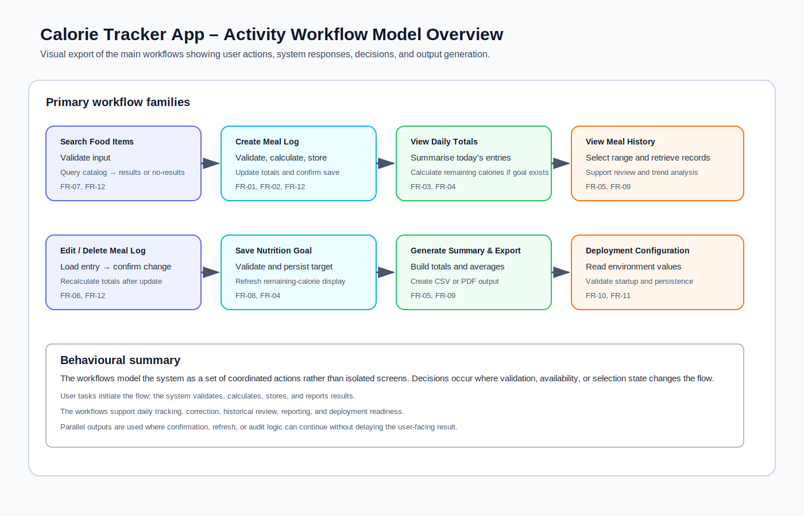

# Calorie Tracker App – Activity Workflow Model

## 1. Purpose and Scope

This document presents the principal workflows of the Calorie Tracker App using UML-style activity diagrams. The objective is to make the operational flow of the system explicit, show how actions are coordinated between the user, the application, and supporting services, and preserve traceability to the functional requirements and use cases.

The report includes a visual overview of the workflows below for quick reference.



*Figure 1: Overview of the principal workflows, their responsibilities, and their traceability to functional requirements.*

Each workflow includes start and end points, decisions, swimlanes, and where appropriate, parallel actions. The workflows are written to reflect the current project scope and the documented stakeholder concerns.

## 2. Traceability Overview

| Workflow | Primary Functional Requirements | Related Use Cases | Related User Stories | Related Sprint Tasks |
|---|---|---|---|---|
| Search Food Items | FR-07, FR-12 | UC-02 | US-001, US-003 | T-001, T-002, T-003, T-011 |
| Create Meal Log | FR-01, FR-02, FR-12 | UC-01 | US-002, US-003 | T-004, T-005, T-006, T-011, T-012 |
| View Daily Totals | FR-03, FR-04 | UC-03 | US-004, US-005 | T-007, T-008 |
| View Meal History | FR-05 | UC-04 | US-006, US-008 | T-012 |
| Edit Meal Log Entry | FR-06, FR-12 | UC-05 | US-007, US-003 | T-011, T-012 |
| Delete Meal Log Entry | FR-06 | UC-05 | US-007 | T-012 |
| Save Nutrition Goal | FR-08, FR-12 | UC-06 | US-005, US-003 | T-008, T-012 |
| Generate Summary and Export Data | FR-05, FR-09 | UC-07 | US-008, US-011 | T-012 |

---

## 3. Workflow 1: Search Food Items

```mermaid
flowchart TD
    start((Start))
    end((End))

    subgraph User
        U1[Enter food name or keyword]
        U2[Review search results]
    end

    subgraph System
        S1[Validate search input]
        D1{Input valid?}
        S2[Query food catalog]
        D2{Matches found?}
        S3[Display results]
        S4[Show no-results message]
    end

    start --> U1 --> S1 --> D1
    D1 -- No --> S4 --> end
    D1 -- Yes --> S2 --> D2
    D2 -- No --> S4
    D2 -- Yes --> S3 --> U2 --> end
```

### Explanation

This workflow begins when the user enters a search term. The system validates the input before querying the food data source. If the term is invalid or the search returns no matches, the system presents a controlled response rather than a failure state.

**Stakeholder alignment:** This workflow addresses the need for fast and accurate food lookup for the Fitness Enthusiast and Professional Athlete. It also supports the Data Provider stakeholder by making the lookup process dependent on a stable data source.

**Requirement alignment:** FR-07 and FR-12.

---

## 4. Workflow 2: Create Meal Log

```mermaid
flowchart TD
    start((Start))
    end((End))

    subgraph User
        U1[Open meal entry form]
        U2[Select meal type]
        U3[Choose food item and portion]
        U4[Submit meal entry]
    end

    subgraph System
        S1[Validate required fields]
        D1{Data valid?}
        S2[Calculate meal calories]
        S3[Store meal entry]
        S4[Update dashboard totals]
        S5[Write confirmation message]
        S6[Display validation feedback]
    end

    start --> U1 --> U2 --> U3 --> U4 --> S1 --> D1
    D1 -- No --> S6 --> end
    D1 -- Yes --> S2 --> S3
    S3 --> S4
    S3 --> S5
    S4 --> end
    S5 --> end
```

### Explanation

The meal creation workflow captures the core behaviour of the application. After the user submits the entry, the system validates the form, calculates calories, stores the record, and updates the dashboard.

The persistence and summary update steps are shown in parallel because the user should receive immediate confirmation while the system refreshes the visible totals. This improves responsiveness and supports reliable record keeping.

**Stakeholder alignment:** The workflow satisfies the primary concern of the Fitness Enthusiast for quick entry and supports the Professional Athlete’s need for precise values.

**Requirement alignment:** FR-01, FR-02, and FR-12.

---

## 5. Workflow 3: View Daily Totals

```mermaid
flowchart TD
    start((Start))
    end((End))

    subgraph User
        U1[Open dashboard]
    end

    subgraph System
        S1[Retrieve today's meal entries]
        S2[Sum calories]
        S3[Check for goal]
        D1{Goal exists?}
        S4[Calculate remaining calories]
        S5[Display summary]
        S6[Display total only]
    end

    start --> U1 --> S1 --> S2 --> S3 --> D1
    D1 -- Yes --> S4 --> S5 --> end
    D1 -- No --> S6 --> end
```

### Explanation

This workflow presents the daily summary used by the main dashboard. The system gathers the current day’s meals, totals the values, and checks whether a nutrition goal exists.

If a goal is available, remaining calories are calculated and displayed. If no goal exists, the system displays the total only and prompts the user to configure one later.

**Stakeholder alignment:** This workflow addresses the requirement for rapid feedback for the Fitness Enthusiast and the precision needs of the Professional Athlete and Fitness Coach.

**Requirement alignment:** FR-03 and FR-04.

---

## 6. Workflow 4: View Meal History

```mermaid
flowchart TD
    start((Start))
    end((End))

    subgraph User
        U1[Open history page]
        U2[Select date range]
        U3[Review history results]
    end

    subgraph System
        S1[Validate date range]
        D1{Range valid?}
        S2[Query stored meals]
        D2{Results found?}
        S3[Group entries by day]
        S4[Display totals and entries]
        S5[Show empty-state message]
    end

    start --> U1 --> U2 --> S1 --> D1
    D1 -- No --> S5 --> end
    D1 -- Yes --> S2 --> D2
    D2 -- No --> S5 --> end
    D2 -- Yes --> S3 --> S4 --> U3 --> end
```

### Explanation

The history workflow enables review of meal behaviour across a selected date range. The system validates the range before querying the database and presenting grouped results.

This workflow is intentionally structured to support summary analysis rather than raw record inspection alone, which is more useful for nutrition review and coaching discussions.

**Stakeholder alignment:** The workflow addresses the information needs of the Nutritionist, Fitness Coach, and Fitness Researcher.

**Requirement alignment:** FR-05 and FR-09.

---

## 7. Workflow 5: Edit Meal Log Entry

```mermaid
flowchart TD
    start((Start))
    end((End))

    subgraph User
        U1[Open existing meal entry]
        U2[Modify meal details]
        U3[Save changes]
    end

    subgraph System
        S1[Load current entry]
        S2[Validate updates]
        D1{Valid?}
        S3[Recalculate calories]
        S4[Persist updated entry]
        S5[Refresh totals]
        S6[Show validation error]
    end

    start --> U1 --> S1 --> U2 --> U3 --> S2 --> D1
    D1 -- No --> S6 --> end
    D1 -- Yes --> S3 --> S4 --> S5 --> end
```

### Explanation

The edit workflow ensures that corrections to a logged meal are validated before they affect totals. The updated values are recalculated and then persisted, after which the summary is refreshed.

This sequence reduces the risk of inconsistent totals and supports the expectation that corrections should be reflected immediately.

**Stakeholder alignment:** The workflow supports the Fitness Enthusiast and Professional Athlete, who require accurate records and fast correction capability.

**Requirement alignment:** FR-06 and FR-12.

---

## 8. Workflow 6: Delete Meal Log Entry

```mermaid
flowchart TD
    start((Start))
    end((End))

    subgraph User
        U1[Select meal entry]
        U2[Confirm deletion]
    end

    subgraph System
        S1[Request confirmation]
        D1{Confirmed?}
        S2[Remove entry]
        S3[Refresh totals]
        S4[Cancel operation]
    end

    start --> U1 --> S1 --> D1
    D1 -- No --> S4 --> end
    D1 -- Yes --> U2 --> S2 --> S3 --> end
```

### Explanation

Deletion requires confirmation so that accidental data loss is avoided. After confirmation, the system removes the entry and refreshes the totals immediately.

This workflow is minimal by design, but it remains an essential control path for maintaining accurate records.

**Stakeholder alignment:** The workflow supports users who need to correct inaccurate entries and helps preserve trust in the summary values.

**Requirement alignment:** FR-06.

---

## 9. Workflow 7: Save Nutrition Goal

```mermaid
flowchart TD
    start((Start))
    end((End))

    subgraph User
        U1[Open goal settings]
        U2[Enter target value]
        U3[Submit goal]
    end

    subgraph System
        S1[Validate range and format]
        D1{Valid?}
        S2[Save goal]
        S3[Recalculate dashboard values]
        S4[Show error message]
    end

    start --> U1 --> U2 --> U3 --> S1 --> D1
    D1 -- No --> S4 --> end
    D1 -- Yes --> S2 --> S3 --> end
```

### Explanation

This workflow allows the user to define the daily calorie target used by dashboard calculations. The system validates the value before saving it, because a malformed target would lead to incorrect remaining-calorie logic.

The dashboard is recalculated immediately after the new target is stored so that the user receives an updated view without delay.

**Stakeholder alignment:** The workflow addresses goal-setting needs for the Fitness Enthusiast, Fitness Coach, and Nutritionist.

**Requirement alignment:** FR-08 and FR-04.

---

## 10. Workflow 8: Generate Summary and Export Data

```mermaid
flowchart TD
    start((Start))
    end((End))

    subgraph User
        U1[Open reports page]
        U2[Select report range]
        U3[Choose export format]
        U4[Download report]
    end

    subgraph System
        S1[Validate selected range]
        D1{Range valid?}
        S2[Retrieve meal history]
        S3[Calculate totals and averages]
        S4[Render summary]
        S5[Prepare export file]
        S6[Store audit record]
        S7[Display error message]
    end

    start --> U1 --> U2 --> S1 --> D1
    D1 -- No --> S7 --> end
    D1 -- Yes --> S2 --> S3 --> S4 --> U3
    U3 --> S5 --> S6
    S5 --> U4 --> end
    S6 --> end
```

### Explanation

The summary and export workflow supports review and reporting tasks. After the user selects a range, the system calculates the relevant statistics, renders the report, and prepares an export file.

The export preparation and audit logging occur as parallel responsibilities because the user-facing download should not depend on internal record keeping completing first. This keeps the workflow efficient while preserving traceability.

**Stakeholder alignment:** This workflow addresses the reporting needs of the Nutritionist, Fitness Coach, Personal Chef, Fitness Researcher, Nutrition NGOs, and Healthy Food Supplier.

**Requirement alignment:** FR-05 and FR-09.

---

## 9. Workflow 9: Add Food Item

```mermaid
flowchart TD
    start((Start))
    end((End))

    subgraph User
        U1[Open add-food form]
        U2[Enter food details]
        U3[Submit food item]
    end

    subgraph System
        S1[Validate required fields]
        D1{Valid?}
        S2[Check for duplicate item]
        D2{Duplicate found?}
        S3[Save food item]
        S4[Index item for search]
        S5[Show confirmation]
        S6[Show validation or duplicate message]
    end

    start --> U1 --> U2 --> U3 --> S1 --> D1
    D1 -- No --> S6 --> end
    D1 -- Yes --> S2 --> D2
    D2 -- Yes --> S6 --> end
    D2 -- No --> S3 --> S4 --> S5 --> end
```

### Explanation

This workflow allows the user to add a food item when the database does not contain a suitable match. The system validates the entry before checking for duplicates so that only clean data is stored. Once saved, the item is indexed for future searches and meal logging.

The workflow is intentionally direct because the primary objective is to extend the catalogue without introducing unnecessary steps that would slow down meal entry.

**Stakeholder alignment:** This workflow addresses catalogue completeness for the Fitness Enthusiast, Professional Athlete, Personal Chef, Data Provider, and Healthy Food Supplier.

**Requirement alignment:** FR-13, FR-07, and FR-12.

---

## 11. Traceability Summary

| Workflow | Stakeholder Value | Related Functional Requirements |
|---|---|---|
| Search Food Items | Rapid and accurate lookup | FR-07, FR-12 |
| Add Food Item | Catalogue extension and missing-item recovery | FR-07, FR-12, FR-13 |
| Create Meal Log | Fast, reliable meal capture | FR-01, FR-02, FR-12 |
| View Daily Totals | Immediate progress visibility | FR-03, FR-04 |
| View Meal History | Historical analysis and review | FR-05, FR-09 |
| Edit Meal Log Entry | Accurate correction of records | FR-06, FR-12 |
| Delete Meal Log Entry | Controlled removal of incorrect entries | FR-06 |
| Save Nutrition Goal | Goal-based progress management | FR-08, FR-04 |
| Generate Summary and Export Data | Structured reporting and sharing | FR-05, FR-09 |

## 12. Summary

The activity workflow model demonstrates how the application behaves as a coordinated sequence of actions rather than as isolated screens. The diagrams show where decisions occur, how the system responds to invalid input, how the catalogue can be extended, and where parallel actions improve responsiveness. Together, the workflows reinforce the behavioural logic behind the documented requirements and use cases.


