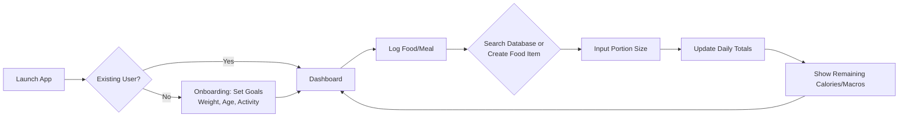
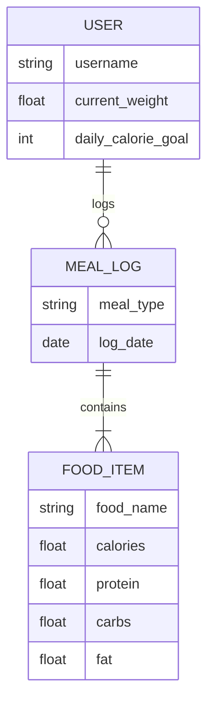
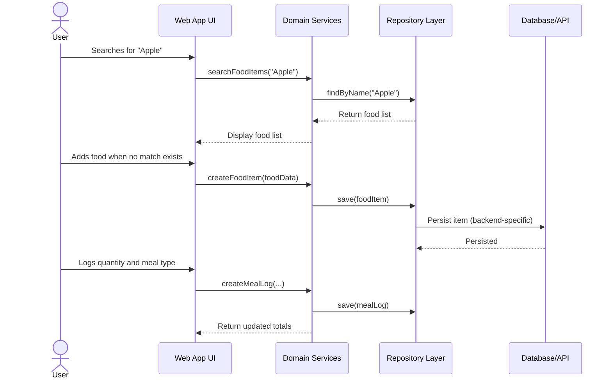

# Calorie Tracker App – System Architecture

## Project Title
Calorie Tracker App

---

## Domain
Health and Nutrition

---

## Problem Statement
Users often struggle to accurately track their daily calorie intake using manual methods. This system provides a digital solution that allows users to record meals, calculate calories automatically, and monitor nutritional habits over time.

---

## Individual Scope
The system is developed by a single developer using a modern web stack consisting of Next.js, TypeScript, Tailwind CSS, and PostgreSQL. The architecture remains intentionally simple while still demonstrating complete front-end, domain, and persistence concerns.

---

## Persistence Layer Overview

The application uses a repository abstraction to decouple storage concerns from domain logic.

- Generic CRUD contract: `src/repositories/Repository.ts`
- Entity contracts: `src/repositories/contracts/`
- In-memory implementations: `src/repositories/inmemory/`
- Backend selection: `src/repositories/factory/RepositoryFactory.ts`
- Future database extension point: `src/repositories/future/DatabaseFoodItemRepository.ts`

This design supports fast in-memory testing today and controlled migration to SQL/NoSQL/API backends later.

---

# C4 Architectural Diagrams

## 1. User Journey Diagram

This diagram shows one session in the progressive web app, including catalogue extension when no matching food item exists.

## 2. Conceptual Domain Snapshot

This diagram shows high-level relationships among core domain entities. The detailed model is documented in `DOMAIN_MODEL.md` and `CLASS_DIAGRAM.md`.

## 3. Sequence Diagram

This diagram shows user interaction flow and system calls to persistence components.

