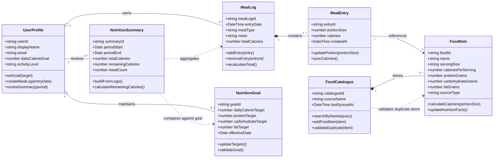

# Calorie Tracker App – Class Diagram

## 1. Purpose
This document presents the structural class model for the Calorie Tracker App. It translates the domain view into an object-oriented representation with classes, attributes, methods, relationships, and multiplicities.

## 2. Mermaid.js Class Diagram

## 3. Key Design Decisions
- The model centres on `MealLog` as the main aggregate because meal entry creation, editing, and deletion all depend on a coherent log.
- `FoodCatalogue` is separated from `MealLog` so that search and catalogue maintenance remain distinct from day-to-day meal capture.
- `NutritionSummary` is treated as derived data rather than persistent user input, which keeps reporting consistent with the recorded meal history.
- `NutritionGoal` remains optional so that the application can still support basic tracking even when a user has not configured a target.
- The `sourceType` attribute on `FoodItem` allows the catalogue to represent standard food references and user-added items in a single structure.

## 4. Design Notes and Traceability
| Class | Main Responsibilities | Related Requirements | Related Use Cases |
|---|---|---|---|
| `UserProfile` | Stores user preferences and goals | FR-03, FR-04, FR-08 | View Daily Totals, Save Goals |
| `FoodCatalogue` | Searches and adds food references | FR-07, FR-13 | Search Food Items, Add Food Item |
| `FoodItem` | Holds nutrition metadata | FR-02, FR-07, FR-13 | Search Food Items, Add Food Item |
| `MealLog` | Groups meal entries and recalculates totals | FR-01, FR-02, FR-06, FR-12 | Create Meal Log, Edit/Delete Meal |
| `MealEntry` | Captures food selection and portion size | FR-01, FR-02, FR-12 | Create Meal Log |
| `NutritionGoal` | Stores target intake values | FR-04, FR-08 | Save Goals |
| `NutritionSummary` | Produces progress and trend views | FR-05, FR-09 | View Meal History, Generate Summaries & Export |

## 5. Implementation Interpretation
The class diagram preserves the same boundaries as the domain model while making object responsibilities explicit. Composition is used where one object cannot exist meaningfully without another, while aggregation is used where ownership exists but lifecycle dependence is weaker. This creates a design that is suitable for implementation while remaining faithful to the documented requirements.
