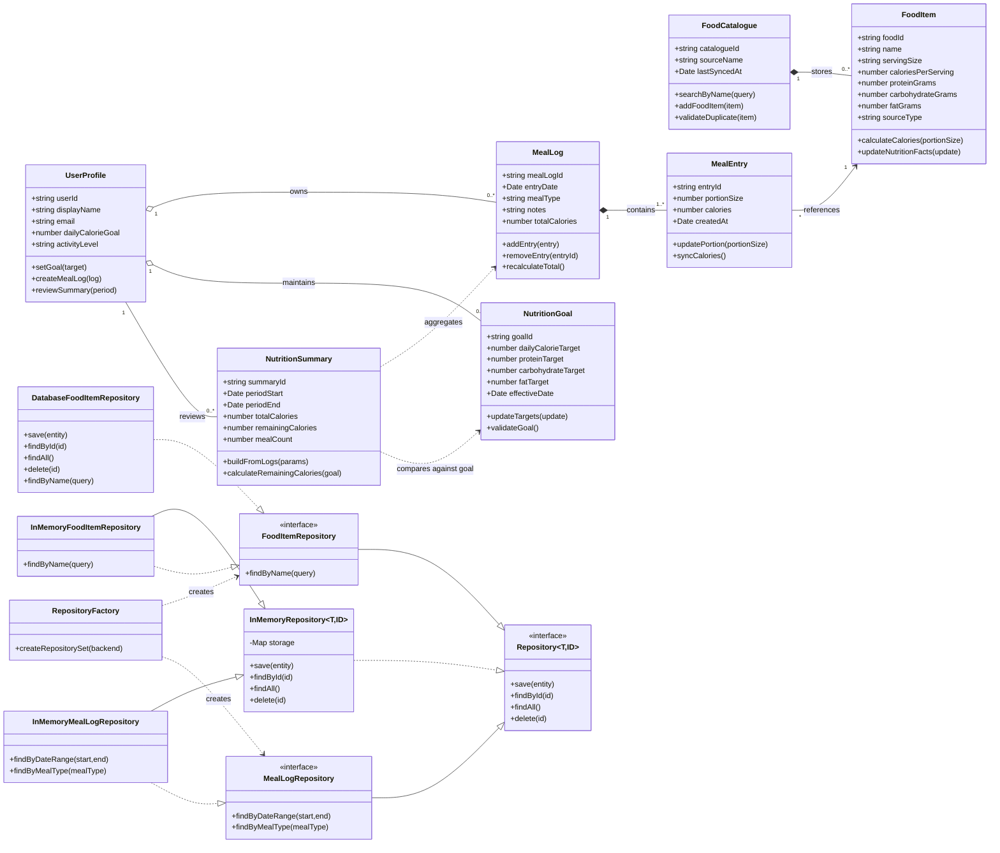

# Calorie Tracker App – Class Diagram

## 1. Purpose
This document presents the structural class model for the Calorie Tracker App. It translates the domain view into an object-oriented representation of classes, attributes, methods, relationships, multiplicities, and persistence abstractions.

## 2. Mermaid.js Class Diagram

## 3. Key Design Decisions
- `MealLog` remains the main aggregate for meal lifecycle operations.
- `FoodCatalogue` is independent from meal logging to separate search and catalogue curation concerns.
- `NutritionSummary` is modelled as derived data to preserve consistency with persisted logs.
- Repository contracts isolate storage concerns from domain logic.
- The in-memory repository family supports fast tests and deterministic behavior.
- The factory provides controlled backend switching without touching service logic.

## 4. Design Notes and Traceability
| Class / Interface | Main Responsibilities | Related Requirements | Related Use Cases |
|---|---|---|---|
| `UserProfile` | Stores identity, preferences, and goal linkage | FR-03, FR-04, FR-08 | View Daily Totals, Save Goals |
| `FoodCatalogue` | Searches and adds food references | FR-07, FR-13 | Search Food Items, Add Food Item |
| `FoodItem` | Holds nutrition metadata | FR-02, FR-07, FR-13 | Search Food Items, Add Food Item |
| `MealLog` | Groups entries and recalculates totals | FR-01, FR-02, FR-06, FR-12 | Create Meal Log, Edit/Delete Meal |
| `MealEntry` | Captures food and portion snapshots | FR-01, FR-02, FR-12 | Create Meal Log |
| `NutritionGoal` | Stores target intake values | FR-04, FR-08 | Save Goals |
| `NutritionSummary` | Produces progress and trend views | FR-05, FR-09 | View Meal History, Generate Summaries & Export |
| `Repository<T, ID>` | Defines storage-agnostic CRUD contract | NFR-MAIN1, NFR-DEP1 | Supports all write/read flows |
| `FoodItemRepository` | Adds food-item query semantics | FR-07, FR-13 | Search Food Items, Add Food Item |
| `MealLogRepository` | Supports meal-log filtering and retrieval | FR-05, FR-06 | View Meal History |
| `InMemoryRepository<T, ID>` | Concrete in-memory CRUD implementation | NFR-PERF1, NFR-MAIN1 | Test and local runtime support |
| `RepositoryFactory` | Switches backend implementation by policy | NFR-DEP1, NFR-MAIN1 | Deployment and runtime configuration |
| `DatabaseFoodItemRepository` | Future persistence extension point | NFR-SCALE1, NFR-SEC1 | Future production storage path |

## 5. Implementation Interpretation
The model keeps domain behavior independent from persistence details. Repository interfaces provide a stable API, in-memory implementations provide immediate operability, and backend stubs reserve extension points for SQL/NoSQL/API adapters. This structure supports incremental evolution without breaking domain logic.
