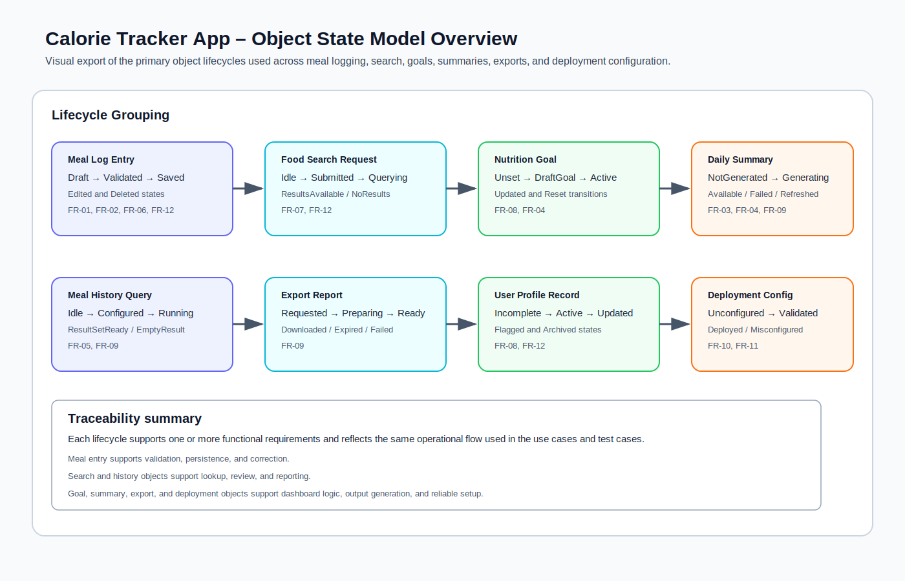
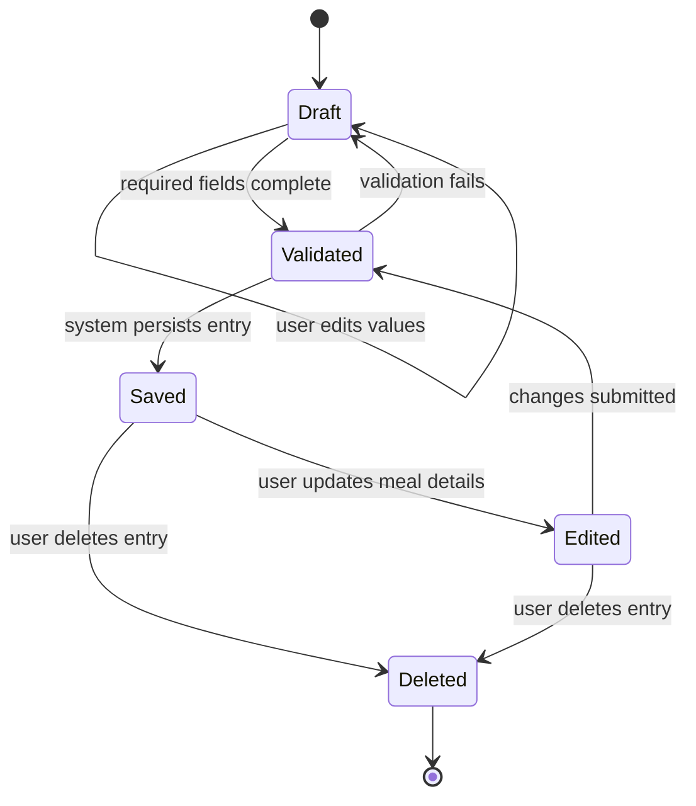
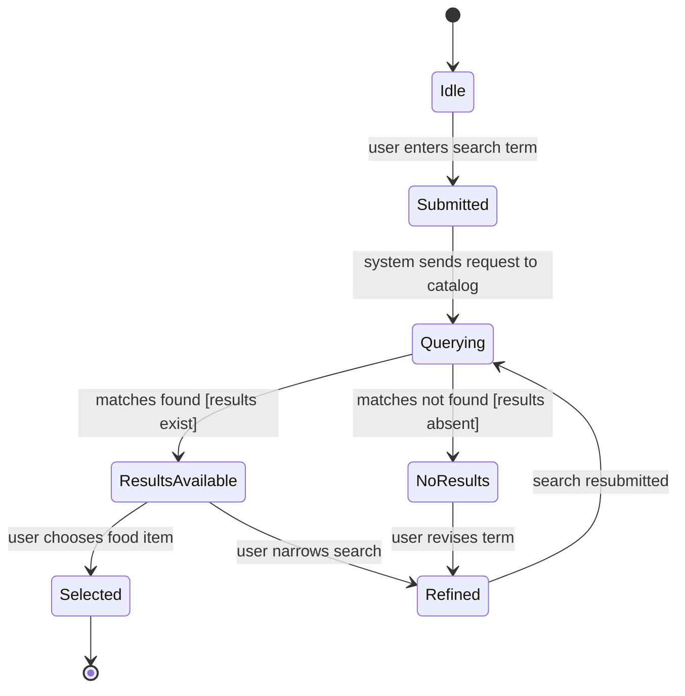
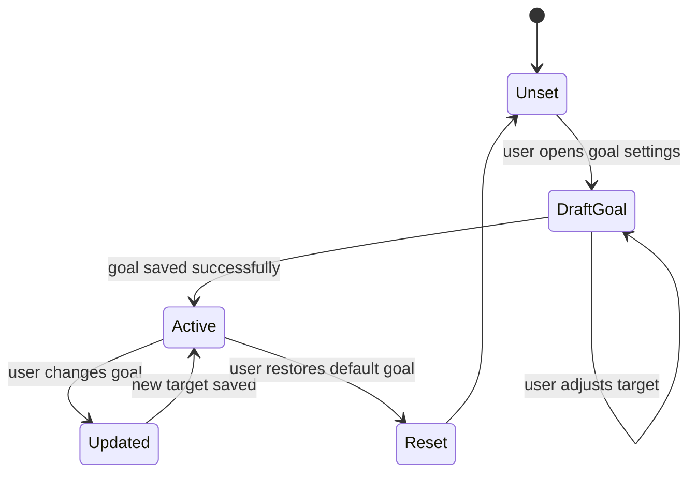
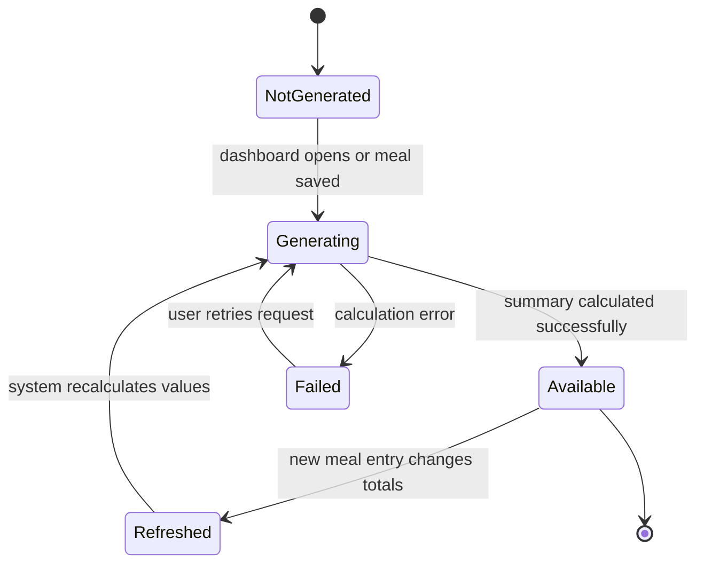
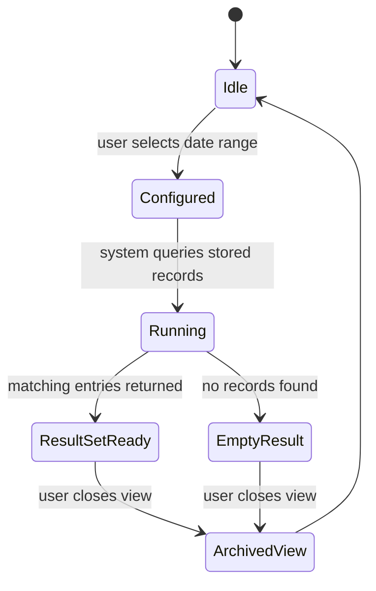
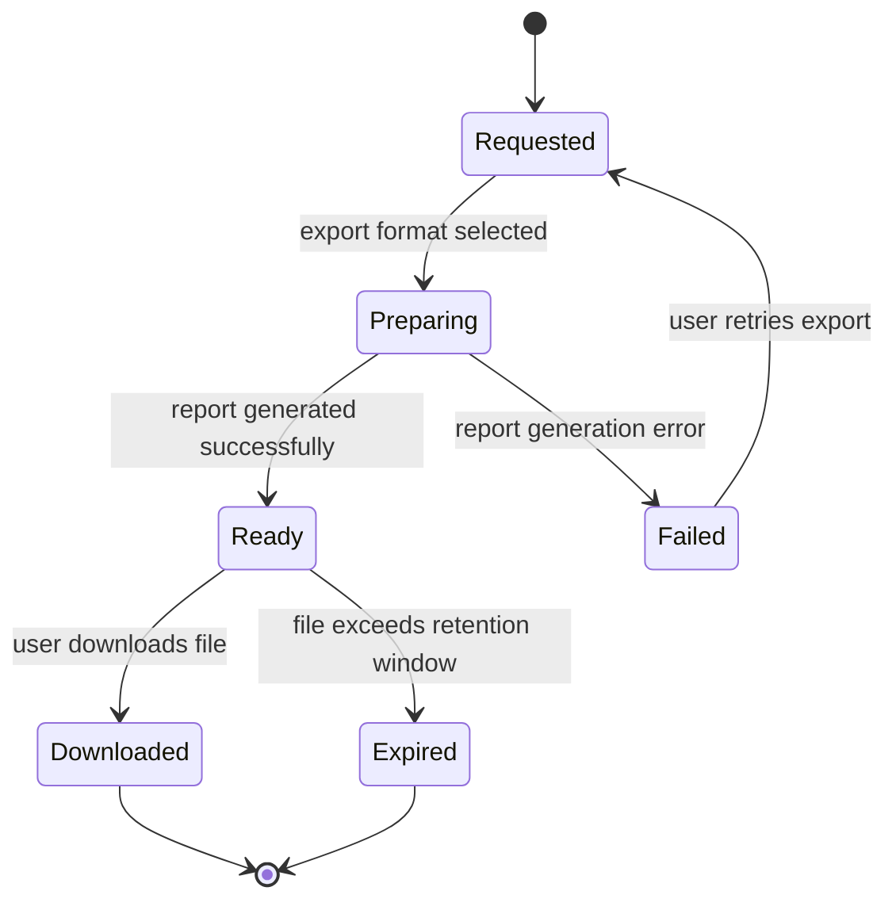
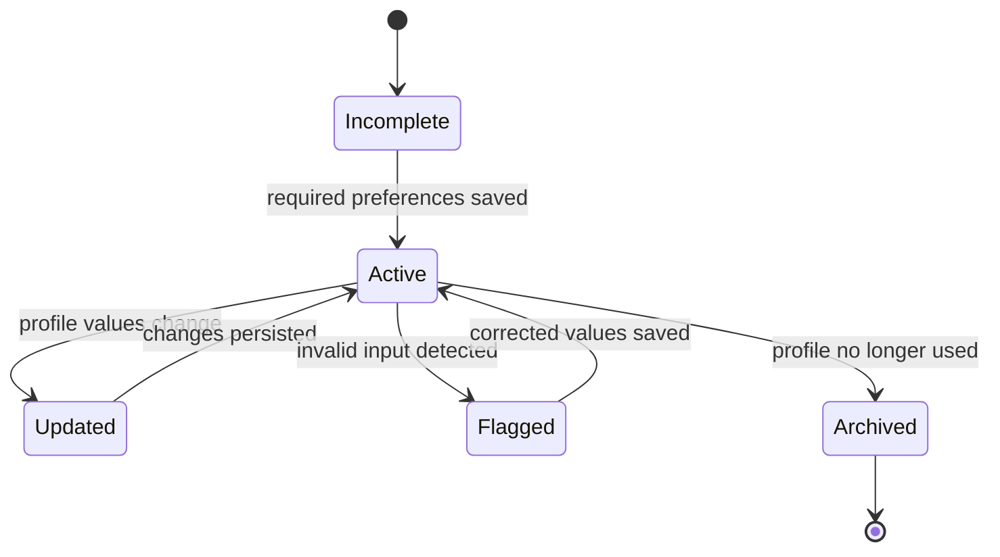
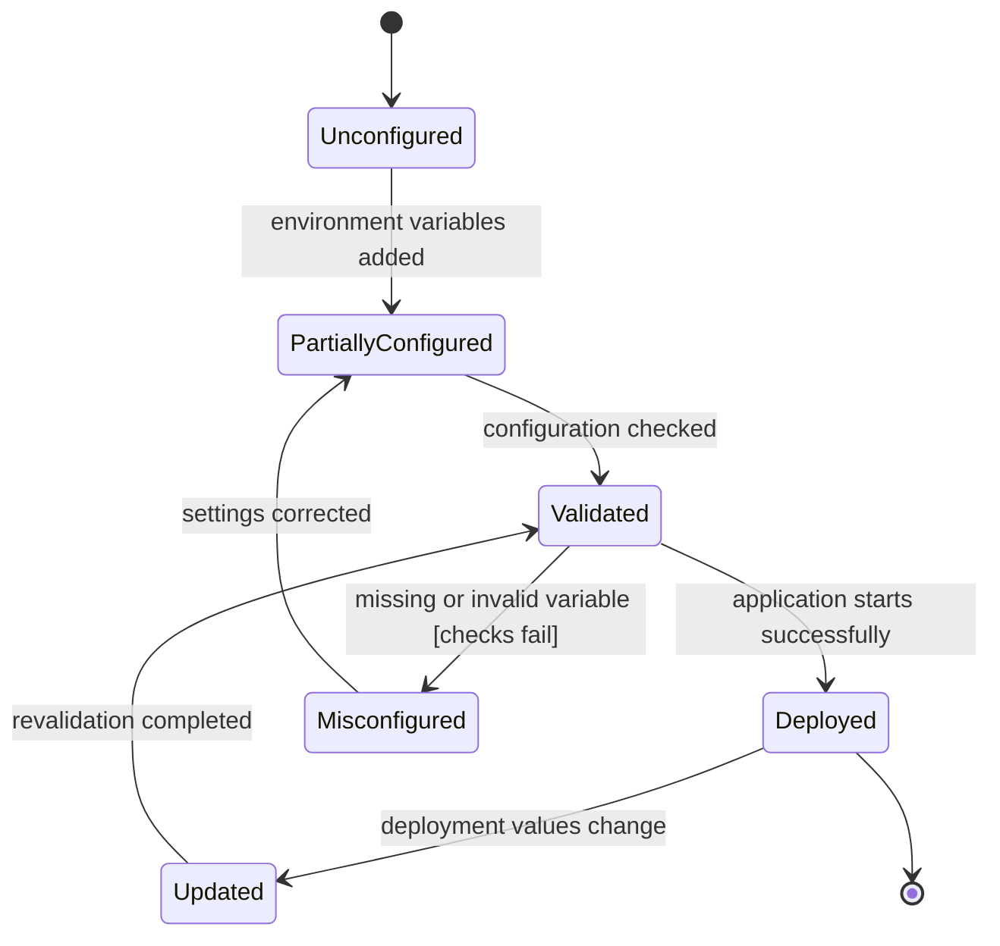
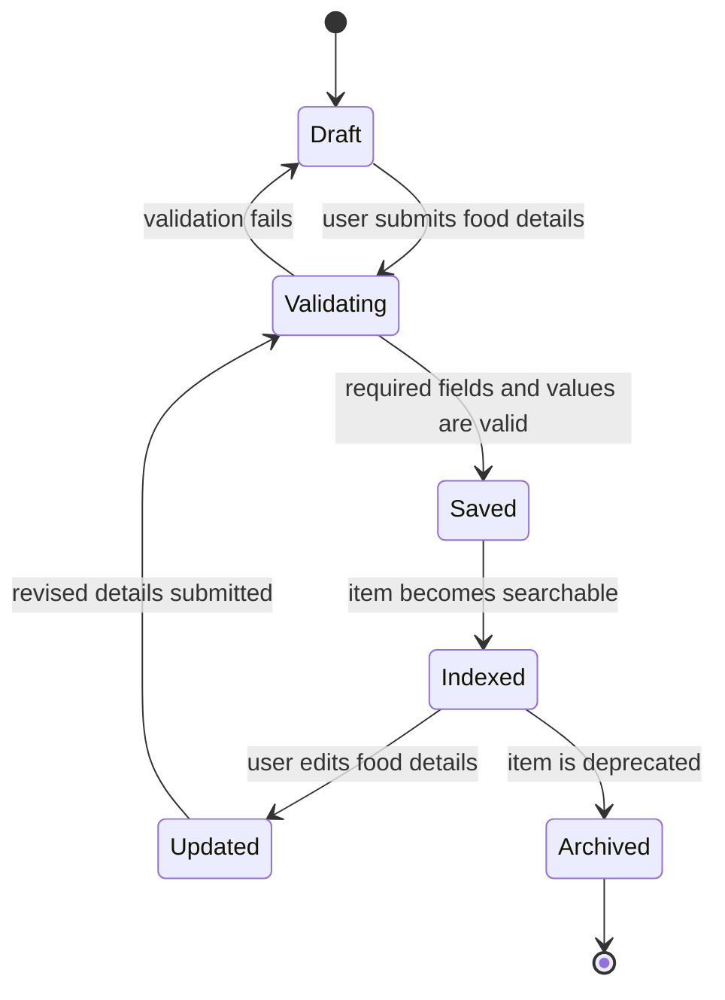

# Calorie Tracker App – Object State Model

## 1. Purpose and Scope

This document presents the lifecycle of key domain objects used by the Calorie Tracker App. The analysis makes object behaviour explicit, strengthens traceability to the functional requirements, and supports the transition from requirements analysis to design.

The report includes a visual overview of the model below for quick reference.

*Figure 1: Overview of the principal object lifecycles and their traceability to functional requirements.*

The model focuses on the core data objects and operational artefacts that recur throughout the application. Each state transition diagram highlights the principal states, the events that trigger state changes, and the functional requirements supported by the lifecycle.

## 2. Traceability Overview

| Object | Primary Functional Requirements | Related User Stories | Related Sprint Tasks | Main Stakeholders |
|---|---|---|---|---|
| Meal Log Entry | FR-01, FR-02, FR-06, FR-12 | US-002, US-003, US-007 | T-004, T-005, T-006, T-011, T-012 | Fitness Enthusiast, Professional Athlete, Personal Chef |
| Food Search Request | FR-07, FR-12 | US-001, US-003 | T-001, T-002, T-003, T-011 | Fitness Enthusiast, Professional Athlete, Healthy Food Supplier |
| Nutrition Goal | FR-08, FR-04 | US-005, US-004 | T-008 | Fitness Enthusiast, Fitness Coach, Nutritionist |
| Daily Summary Snapshot | FR-03, FR-04, FR-09 | US-004, US-008 | T-007, T-008, T-012 | Fitness Enthusiast, Professional Athlete, Fitness Coach, Nutritionist |
| Meal History Query | FR-05, FR-09 | US-006, US-008 | T-012 | Nutritionist, Fitness Coach, Fitness Researcher |
| Export Report | FR-09 | US-008, US-011 | T-012 | Nutritionist, Fitness Coach, Personal Chef, Fitness Researcher, Nutrition NGOs |
| User Profile Record | FR-08, FR-12 | US-005, US-003 | T-004, T-008 | Fitness Enthusiast, Fitness Coach, Software Developer |
| Deployment Configuration | FR-10, FR-11 | US-009, US-010 | T-009, T-010 | Software Developer, Data Provider |

---

## 3. Meal Log Entry

### State Diagram

### Explanation

The Meal Log Entry begins in a **Draft** state while the user enters meal information. Once the required fields are complete, the entry moves to **Validated**, where the system confirms that the values are acceptable for persistence. The transition to **Saved** occurs only after successful validation and database storage.

The entry may then move to **Edited** when the user corrects quantity, meal type, or food selection. A revised submission returns the object to **Validated** before it is stored again. The **Deleted** state closes the lifecycle when the user removes the record.

**Requirement alignment:**
- **FR-01** is supported by the creation and persistence path.
- **FR-02** is supported by automatic calorie calculation before saving.
- **FR-06** is supported by the edit and delete transitions.
- **FR-12** is supported by the validation gate between draft and saved states.

---

## 4. Food Search Request

### State Diagram

### Explanation

A Food Search Request is initiated when the user submits a keyword or filter value. The request transitions to **Querying** while the system retrieves matching food items. If matches are returned, the request becomes **ResultsAvailable**; otherwise, it enters **NoResults** and prompts refinement.

The object closes once the user selects a food item for meal logging. This lifecycle supports the search process without exposing unnecessary complexity in the user interface.

**Requirement alignment:**
- **FR-07** is addressed through search and filtering behaviour.
- **FR-12** is supported by handling invalid or incomplete search input.

---

## 5. Nutrition Goal

### State Diagram

### Explanation

The Nutrition Goal begins as **Unset** until the user provides a target. Once the target is entered and stored, the object becomes **Active** and is used by the dashboard to calculate remaining calories. When the user changes the target, the goal transitions through **Updated** before returning to an active state.

A reset action returns the object to a neutral state so that the application can prompt the user for a new target later.

**Requirement alignment:**
- **FR-08** is supported by persistence of the daily goal.
- **FR-04** is supported by linking the goal to remaining-calorie calculations.

---

## 6. Daily Summary Snapshot

### State Diagram

### Explanation

A Daily Summary Snapshot represents the calculated total for the current day. It is **NotGenerated** until the user opens the dashboard or a new meal entry changes the underlying totals. The system then enters **Generating** and computes the summary values.

If the calculation succeeds, the snapshot becomes **Available**. Any new meal entry causes the snapshot to move into **Refreshed**, after which the system recalculates the total. A calculation failure transitions the object to **Failed**, where a retry can be initiated.

**Requirement alignment:**
- **FR-03** is addressed through daily total calculation.
- **FR-04** is addressed through remaining-calorie computation.
- **FR-09** is supported by the summary values used in reporting.

---

## 7. Meal History Query

### State Diagram

### Explanation

The Meal History Query begins in an **Idle** state and becomes **Configured** once the user selects a date range. It then enters **Running** while the system searches the database for matching entries.

If records are found, the query transitions to **ResultSetReady**. If no records match, the object moves to **EmptyResult** so the interface can display a neutral response instead of an error condition. The view is archived when the user exits the page.

**Requirement alignment:**
- **FR-05** is directly supported by date-range retrieval.
- **FR-09** is supported by reusing history data in summaries.

---

## 8. Export Report

### State Diagram

### Explanation

An Export Report is created when the user requests a summary in CSV or PDF format. After the format is selected, the report moves to **Preparing** while the system compiles the dataset. If generation succeeds, the report becomes **Ready** and can be downloaded. If a failure occurs, the report transitions to **Failed** and may be requested again.

This lifecycle ensures that export activity remains explicit, controlled, and traceable.

**Requirement alignment:**
- **FR-09** is supported through summary export and downloadable reporting.

---

## 9. User Profile Record

### State Diagram

### Explanation

The User Profile Record remains **Incomplete** until the user saves the necessary preferences or goal-related information. Once the record is valid and persisted, it becomes **Active** and contributes to dashboard behaviour and user preferences.

If profile values change, the object enters **Updated** and then returns to **Active** when the revised information is stored. Invalid data temporarily moves the record to **Flagged**, allowing correction before persistence.

**Requirement alignment:**
- **FR-08** is supported by saved preferences and calorie targets.
- **FR-12** is supported by validation feedback for invalid input.

---

## 10. Deployment Configuration

### State Diagram

### Explanation

Deployment Configuration begins as **Unconfigured** and becomes **PartiallyConfigured** when the required environment values are supplied. The system or maintainer then validates the settings before deployment. If validation succeeds, the configuration becomes **Deployed** and the application can run in the target environment.

If any required setting is missing or incorrect, the object enters **Misconfigured** until the values are corrected and revalidated.

**Requirement alignment:**
- **FR-10** is supported by PostgreSQL persistence configuration.
- **FR-11** is supported by environment-based application setup.

---

## 11. Food Catalog Entry

### State Diagram

### Explanation

A Food Catalog Entry begins in **Draft** while the user enters the food name and nutritional values. The entry moves to **Validating** once the user submits it. If the input is acceptable, the record is saved and then **Indexed** so that it becomes available in search results and meal logging.

If the user later revises the entry, the object transitions to **Updated** and returns to validation before it is saved again. An item may be moved to **Archived** when it is no longer appropriate for active use.

**Requirement alignment:**
- **FR-13** is supported by creating and storing a new food item.
- **FR-07** is supported by making the new item searchable.
- **FR-12** is supported by validating the entry before persistence.

---

## 12. Summary

The object state model shows that the application is not only a collection of screens and queries; it is also a collection of structured lifecycles. These lifecycles support validation, persistence, update, retrieval, reporting, catalogue maintenance, and deployment control in a manner that is consistent with the documented functional requirements.

