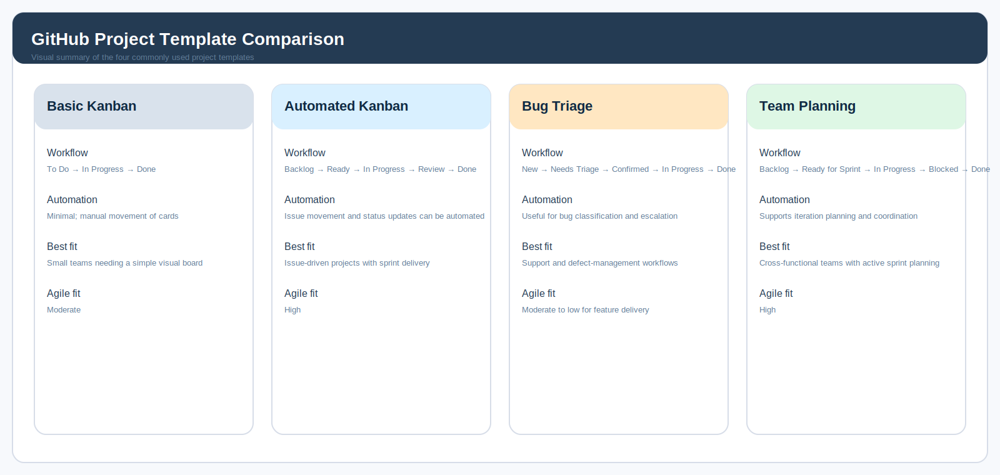

# Calorie Tracker App – GitHub Project Template Analysis

## 1. Introduction
This document evaluates the GitHub Projects templates available for Agile work management and identifies the template most appropriate for the Calorie Tracker App. The analysis is aligned with the sprint-based delivery approach defined in the project’s Agile planning document.

## 2. Template Comparison Figure

*Figure 1: Visual summary of the GitHub Project templates considered for the Calorie Tracker App.*

## 3. Evaluation Criteria

The templates are assessed using four practical criteria:

- **Workflow clarity:** how easily work can move from idea to completion.
- **Automation support:** how much manual board maintenance is reduced.
- **Traceability:** how well issues, labels, milestones, and reviews remain connected.
- **Agile fit:** how well the template supports iterative delivery, visibility, and work-in-progress control.

## 4. Template Profiles

### 4.1 Basic Kanban
**What it is:** A minimal project board that uses a simple visual flow such as **To Do → In Progress → Done**.

**What it does:** It lets a team track work items across a lightweight sequence of stages without enforcing complex planning rules.

**Competitive edge:** Its main advantage is simplicity. It is easy to understand, quick to configure, and useful for teams that want a low-friction board with minimal administration.

**Fit for the Calorie Tracker App:** It is suitable for basic task visibility, but it offers limited support for sprint tracking, testing, and more detailed delivery control.

### 4.2 Automated Kanban
**What it is:** A structured Kanban-style template designed to support a continuous flow of work, often using **Backlog → Ready → In Progress → Review → Done**.

**What it does:** It tracks issues through the delivery lifecycle and can automate movement or status changes when issues, pull requests, or labels change.

**Competitive edge:** Its strongest advantage is workflow automation. It reduces manual board maintenance while preserving visibility and traceability across planning, implementation, review, and completion.

**Fit for the Calorie Tracker App:** It is the strongest match because the project is issue-driven, sprint-oriented, and benefits from clear task progression, testing visibility, and low overhead.

### 4.3 Bug Triage
**What it is:** A template designed for managing defects, support requests, and issue escalation through a structured triage process.

**What it does:** It supports classification, assignment, confirmation, and resolution of bugs, usually through columns such as **New → Needs Triage → Confirmed → In Progress → Done**.

**Competitive edge:** Its main advantage is defect management discipline. It helps teams prioritise bugs quickly and maintain a clean support workflow.

**Fit for the Calorie Tracker App:** It is useful only if the board becomes defect-heavy. For the current project, it is less suitable than a delivery-focused template because the emphasis is on planned feature work.

### 4.4 Team Planning
**What it is:** A planning-oriented template for coordinating work across a team, typically using **Backlog → Ready for Sprint → In Progress → Blocked → Done** with iteration views.

**What it does:** It supports prioritisation, sprint coordination, milestone tracking, and visibility into blocked work.

**Competitive edge:** Its advantage is stronger planning control. It is particularly useful when a project requires coordination across multiple contributors and more explicit sprint governance.

**Fit for the Calorie Tracker App:** It is helpful from a planning perspective, but it is more process-heavy than necessary for a compact academic project that needs straightforward issue tracking and lightweight sprint flow.

## 5. Comparative Analysis of Available Templates

| Template | Key Benefits | Notable Drawbacks | Widely Adopted? | Agile Suitability |
|---|---|---|---|---|
| **Basic Kanban** | Simple to understand; fast to configure; low administrative effort. | Limited automation; less support for sprint rhythm, review stages, and traceability. | Yes, commonly used for small teams and personal boards. | Suitable for basic Agile visibility, but limited for richer sprint-based delivery. |
| **Automated Kanban** | Strong workflow automation; good traceability; supports issue-based delivery and review stages. | Requires more setup than a basic board; can still be light on formal sprint reporting compared with planning-heavy tools. | Yes, widely used in modern software teams. | Highly suitable for Agile because it supports continuous flow, WIP control, and iterative delivery. |
| **Bug Triage** | Excellent defect handling; clear prioritisation of fixes; good for support operations. | Less effective for feature-led planning; can overemphasise bugs over product delivery. | Yes, especially in maintenance and support environments. | Moderately suitable; best for defect management rather than primary Agile planning. |
| **Team Planning** | Strong sprint organisation; clearer capacity planning; useful for blocked work and iterations. | More process-heavy; can feel complex for smaller projects. | Yes, frequently adopted by teams that want structured sprint planning. | Highly suitable for Agile planning, especially in multi-person sprint environments. |

## 6. Selected Template and Justification

The **Automated Kanban** template is the most suitable option for the Calorie Tracker App.

### Justification
1. **Alignment with Agile delivery.** The project is organized around user stories, sprint planning, and incremental delivery, which are well supported by a Kanban-style workflow.
2. **Reduced administrative overhead.** Automation minimizes manual board updates and helps keep the board current as issues move from one stage to another.
3. **Improved traceability.** The project already uses functional requirements, use cases, and sprint tasks with clear identifiers. An issue-driven template strengthens that traceability.
4. **Support for quality assurance.** The board can be extended with **Testing** and **Blocked** columns, which are necessary for formal review and defect resolution.
5. **Appropriate project scale.** The calorie tracker is a semester project with a limited scope. Automated Kanban provides sufficient structure without the complexity of enterprise planning tools.

## 7. Custom Kanban Board Configuration

The project board should be adapted from the selected template using the following columns:

| Column | Purpose | WIP Guidance | Exit Criteria |
|---|---|---|---|
| **Backlog** | Holds all approved user stories and sprint tasks awaiting prioritisation. | No fixed limit. | The item has been refined and is ready for planning. |
| **Ready** | Contains tasks selected for the current sprint but not yet started. | Limited to the sprint capacity. | Acceptance criteria are clear and the assignee is confirmed. |
| **In Progress** | Tracks tasks that are actively being developed. | Maximum of 3 items per contributor. | Implementation is functionally complete. |
| **Review** | Holds completed work awaiting code or document review. | Maximum of 2 items. | The reviewer approves the task or requests revisions. |
| **Testing** | Used for functional validation, regression checks, and acceptance testing. | Maximum of 2 items. | Test evidence confirms that the requirement has been satisfied. |
| **Blocked** | Captures items that cannot proceed because of a dependency or defect. | No fixed limit, but each item must include an explanation. | The obstacle is removed and the task returns to the active flow. |
| **Done** | Contains items that meet the definition of done and have been accepted. | No limit. | All criteria are complete, verified, and documented. |

## 8. Issue Allocation Plan

The sprint board should be populated with the tasks from `AGILE_PLANNING.md`. The following table shows how the initial items should be distributed across the project board.

| Task ID | Task Description | Linked Story ID | Suggested Label(s) | Initial Column | Suggested Assignee |
|---|---|---|---|---|---|
| T-001 | Define the food search fields, filters, and result layout | US-001 | `feature`, `frontend`, `sprint-1` | Ready | @product-owner, @frontend-dev |
| T-002 | Build the food search API endpoint and data lookup logic | US-001 | `feature`, `backend`, `sprint-1` | Backlog | @backend-dev |
| T-003 | Implement the search results component and selection flow | US-001 | `feature`, `frontend`, `sprint-1` | Ready | @frontend-dev |
| T-004 | Add meal form validation rules and inline error messages | US-003 | `feature`, `frontend`, `backend`, `sprint-1` | Backlog | @frontend-dev, @backend-dev |
| T-005 | Build the meal log form and save action | US-002 | `feature`, `frontend`, `sprint-1` | Ready | @frontend-dev |
| T-006 | Implement meal persistence and calorie calculation in PostgreSQL | US-002 | `feature`, `backend`, `database`, `sprint-1` | Backlog | @backend-dev |
| T-007 | Wire the dashboard summary card for today’s totals | US-004 | `feature`, `frontend`, `sprint-1` | Ready | @frontend-dev |
| T-008 | Add remaining-calories calculation and prompt for missing goals | US-004 | `feature`, `backend`, `sprint-1` | Backlog | @backend-dev |
| T-009 | Configure environment variables, secrets handling, and database connection | US-009, US-010 | `devops`, `security`, `sprint-1` | In Progress | @devops |
| T-010 | Add HTTPS-ready deployment notes and runtime checks | US-010 | `devops`, `security`, `sprint-1` | Backlog | @devops |
| T-011 | Write unit tests for search, validation, and calorie calculation | US-001, US-002, US-003 | `qa`, `test`, `sprint-1` | Ready | @qa-analyst |
| T-012 | Run end-to-end smoke checks for meal entry and dashboard updates | US-002, US-004 | `qa`, `acceptance`, `sprint-1` | Ready | @qa-analyst, @product-owner |

## 9. Board Governance

To maintain consistency, each issue should include:
- the linked story ID,
- the applicable functional requirement IDs,
- the acceptance criteria,
- the expected assignee,
- the current board column,
- and any dependencies or blockers.

The board should be reviewed during sprint planning and updated during stand-ups or progress reviews. This approach supports transparency, preserves traceability, and keeps the work aligned with the documented requirements.

## 10. Conclusion

The **Automated Kanban** template provides the best balance of simplicity, traceability, and workflow control for the Calorie Tracker App. It supports the project’s sprint structure, accommodates testing and blocker management, and creates a clear operational link between requirements, issues, and delivery status.
