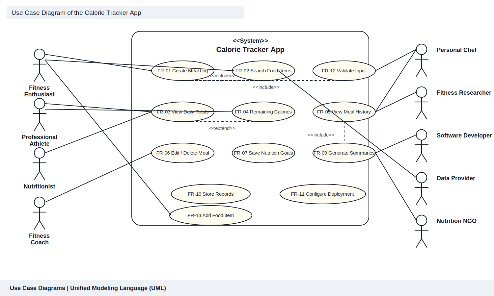

# Calorie Tracker App – Test and Use Case Document

## 1. Purpose and Traceability

This document connects the stakeholder concerns in `STAKEHOLDER_ANALYSIS.md` to the functional and non-functional requirements in `SYSTEM_REQUIREMENTS.md`, then translates them into UML use cases and test cases.

The current project scope focuses on calorie tracking, meal logging, nutrition summaries, and deployment or maintenance support. Stakeholders such as advertisers and healthy food suppliers are retained in the analysis as future or indirect stakeholders, but they are not modelled as core initiating actors in the current scope.

---

## 2. Stakeholder-to-Use-Case Alignment

| Stakeholder | Care / Quadrant | Why They Care | Primary Use Cases | Scope Note |
|---|---|---|---|---|
| Fitness Enthusiast | High / Keep Informed | Wants fast meal entry, daily progress, and habit tracking. | UC-01, UC-02, UC-03, UC-04, UC-05, UC-06 | Core actor |
| Professional Athlete | High / Keep Informed | Needs precision, performance tracking, and reliable reports. | UC-01, UC-03, UC-04, UC-06, UC-07 | Core actor |
| Nutritionist | High / Manage Closely | Needs history, trends, and exportable records for client guidance. | UC-04, UC-07 | Core actor |
| Fitness Coach | High / Keep Informed | Wants consistent progress updates and shareable summaries. | UC-04, UC-07 | Core actor |
| Personal Chef | Medium / Monitor | Uses summaries to align portions with nutrition targets. | UC-07 | Supporting actor |
| Fitness Researcher | High / Keep Informed | Needs structured historical data for trend analysis. | UC-04, UC-07 | Supporting actor |
| Software Developer | High / Manage Closely | Needs maintainable code, stable deployment, and clear documentation. | UC-08 | Core support actor |
| Data Provider | High / Keep Satisfied | Supplies food data accuracy and uptime for search and calculation. | UC-02, UC-01 | External system stakeholder |
| Nutrition NGO | Medium / Keep Satisfied | Interested in evidence-based, aggregated public-health insights. | UC-07 | Indirect / future use |
| Healthy Food Supplier | Medium / Monitor | Wants partnership visibility and product-relevant insights. | UC-07 | Indirect / future use |
| Advertiser | High / Keep Satisfied | Cares about engagement and audience visibility. | Not core to current FRs | Out of current scope |

---

## 3. UML Use Case Diagram

The use case diagram is embedded below as an SVG image so it renders consistently without relying on Mermaid support.

*Figure 1: UML use case diagram with actors outside the system boundary and use cases inside the Calorie Tracker App boundary.*

### 3.1 Key Actors and Roles

- **Fitness Enthusiast:** Core user who logs meals, tracks progress, and checks daily totals.
- **Professional Athlete:** High-precision user who depends on accurate totals and summary views.
- **Nutritionist:** Reviews history and exports for client consultation.
- **Fitness Coach:** Uses history and summaries to guide training and nutrition decisions.
- **Personal Chef:** Uses exported summaries to prepare meals aligned with goals.
- **Fitness Researcher:** Reviews historical data for patterns and evidence-based analysis.
- **Software Developer:** Maintains the app, verifies deployment, and supports persistence.
- **Data Provider:** Supplies the food dataset used for search and calorie lookup.
- **Nutrition NGO:** Consumes summary outputs for public-health awareness and education.

### 3.2 Relationships Between Actors and Use Cases

- **Inclusion (`<<include>>`):**
  - `FR-01 Create Meal Log` includes `FR-02 Search Food Items` because users must locate a food item before saving it.
  - `FR-01 Create Meal Log` includes `FR-12 Validate Meal Input` because invalid data must be blocked before persistence.
  - `FR-09 Generate Summaries & Export` includes `FR-05 View Meal History` because reports are built from stored history.

- **Extension (`<<extend>>`):**
  - `FR-03 View Daily Totals` extends to `FR-04 View Remaining Calories` because remaining calories are only shown when a goal exists.

- **Direct Associations:**
  - End users drive meal logging, goal setting, history review, and summaries.
  - The developer supports persistence and deployment configuration.
  - The data provider supports food search and nutrition lookup.

### 3.3 How the Diagram Addresses Stakeholder Concerns

- **Fast entry for the Fitness Enthusiast** is addressed by `FR-02` and `FR-01`.
- **Precision for the Professional Athlete** is addressed by `FR-03`, `FR-04`, and `FR-07`.
- **Professional review for the Nutritionist and Fitness Coach** is addressed by `FR-05` and `FR-09`.
- **Maintainability and deployment reliability for the Software Developer** are addressed by `FR-10` and `FR-11`.
- **Data quality for the Data Provider** is represented through direct support of the food-search workflow.

---

## 4. Detailed Use Case Specifications

### UC-01: Create Meal Log

**Primary Actor(s):** Fitness Enthusiast, Professional Athlete  
**Supporting Actor(s):** Data Provider  
**Requirement(s):** FR-01, FR-02, FR-11  
**Priority:** Critical

**Description:** The user records a meal by choosing a meal type, searching or entering a food item, specifying a portion, and saving the entry. The system calculates calories, validates the data, and stores the record.

**Preconditions:**
- User is authenticated.
- Food data is available for lookup.
- The meal entry form is available.

**Postconditions:**
- Meal is saved to the database.
- Calorie total is calculated and stored.
- Daily summary values are updated.

**Basic Flow:**
1. User opens the meal logging form.
2. User selects a meal type.
3. User searches for a food item.
4. System displays matching food items.
5. User selects a food item and enters a portion.
6. System calculates total calories.
7. System validates required fields and values.
8. User saves the meal.
9. System stores the meal and updates totals.

**Alternative Flows:**
- **A1: No matching food item** — User enters a custom food item manually.
- **A2: Invalid portion** — System shows a validation message and blocks submission.
- **A3: Network/data lookup failure** — System shows a retry message and preserves entered data.

---

### UC-02: Search Food Items

**Primary Actor(s):** Fitness Enthusiast, Professional Athlete  
**Supporting Actor(s):** Data Provider  
**Requirement(s):** FR-07  
**Priority:** Critical

**Description:** The user searches for foods by keyword or filter so the correct food item can be used in meal logging.

**Preconditions:**
- Search interface is loaded.
- Food data source is available.

**Postconditions:**
- Relevant matches are displayed.
- Selected item can be used in meal logging.

**Basic Flow:**
1. User enters a search term.
2. System queries the food catalog.
3. System returns matching results.
4. User reviews the list.
5. User selects a food item.
6. System passes the selected item to the meal form.

**Alternative Flows:**
- **A1: No results** — System offers a custom-entry option.
- **A2: Poor match quality** — System suggests broader terms or filters.

---

### UC-03: View Daily Totals

**Primary Actor(s):** Fitness Enthusiast, Professional Athlete  
**Requirement(s):** FR-03, FR-04  
**Priority:** Critical

**Description:** The user opens the dashboard to review total calories consumed today and, when a goal exists, the remaining calories.

**Preconditions:**
- User is authenticated.
- At least one meal exists, or the dashboard has default values.

**Postconditions:**
- The current day’s totals are visible.
- Remaining calories are shown when a goal exists.

**Basic Flow:**
1. User opens the dashboard.
2. System retrieves today’s meal entries.
3. System sums calorie values.
4. System retrieves the daily goal.
5. System calculates remaining calories.
6. System displays totals and progress indicators.

**Alternative Flows:**
- **A1: No meals logged today** — Dashboard shows zero values and a call to action.
- **A2: Goal not set** — Dashboard shows consumed total only and prompts the user to set a goal.

---

### UC-04: View Meal History

**Primary Actor(s):** Fitness Enthusiast, Nutritionist, Fitness Coach, Fitness Researcher  
**Requirement(s):** FR-05  
**Priority:** Important

**Description:** The user views historical meal logs by day, week, or custom date range to review patterns and trends.

**Preconditions:**
- User is authenticated.
- Historical records exist.

**Postconditions:**
- Selected meal history is displayed.
- Totals and patterns are visible for the selected range.

**Basic Flow:**
1. User opens the history page.
2. User selects a date range.
3. System queries the relevant records.
4. System groups entries by day.
5. System displays totals and meal details.
6. User optionally expands a day for more detail.

**Alternative Flows:**
- **A1: No history found** — System shows an empty-state message.
- **A2: Large date range** — System paginates or summarizes the data.

---

### UC-05: Edit or Delete Meal Log Entry

**Primary Actor(s):** Fitness Enthusiast, Professional Athlete  
**Requirement(s):** FR-06  
**Priority:** Important

**Description:** The user corrects or removes an existing meal entry and the system recalculates totals immediately.

**Preconditions:**
- User is authenticated.
- The meal entry exists and belongs to the user.

**Postconditions:**
- Updated or deleted meal is reflected in history.
- Daily totals are recalculated.

**Basic Flow (Edit):**
1. User opens an existing meal entry.
2. System shows the current values.
3. User updates the meal details.
4. System recalculates calories.
5. User saves changes.
6. System persists the update and refreshes totals.

**Basic Flow (Delete):**
1. User selects a meal entry.
2. User chooses delete.
3. System asks for confirmation.
4. User confirms deletion.
5. System removes the record and updates totals.

**Alternative Flows:**
- **A1: Invalid edit values** — System blocks save and highlights the invalid field.
- **A2: User cancels deletion** — No changes are made.

---

### UC-06: Save Personal Nutrition Goals

**Primary Actor(s):** Fitness Enthusiast, Professional Athlete  
**Requirement(s):** FR-08  
**Priority:** Important

**Description:** The user saves or updates a personal daily calorie goal used in dashboard calculations.

**Preconditions:**
- User is authenticated.
- Goal settings page is available.

**Postconditions:**
- Goal is persisted.
- Dashboard values recalculate using the new goal.

**Basic Flow:**
1. User opens goal settings.
2. System shows the current goal or a default value.
3. User enters a new target.
4. System validates the range and format.
5. User confirms the change.
6. System stores the goal and refreshes the dashboard.

**Alternative Flows:**
- **A1: Out-of-range goal** — System warns the user and requests confirmation or correction.
- **A2: Reset request** — Goal reverts to the default value.

---

### UC-07: Generate Summaries and Export Data

**Primary Actor(s):** Nutritionist, Fitness Coach, Personal Chef, Fitness Researcher, Nutrition NGO  
**Requirement(s):** FR-09, FR-05  
**Priority:** Important

**Description:** The user generates summaries of calorie intake and meal activity for a chosen date range and exports the results.

**Preconditions:**
- User is authenticated.
- Historical data exists for the chosen range.

**Postconditions:**
- Summary is displayed.
- Export file is produced when requested.

**Basic Flow:**
1. User opens the reports page.
2. User chooses a date range.
3. System loads history for the selected range.
4. System calculates totals, averages, and counts.
5. System renders the summary.
6. User exports the result as CSV or PDF.

**Alternative Flows:**
- **A1: No records in range** — System shows an empty-state report.
- **A2: Export failure** — System retries or displays an error message.

---

### UC-08: Configure Deployment Environment

**Primary Actor(s):** Software Developer  
**Requirement(s):** FR-10, FR-11  
**Priority:** Important

**Description:** The maintainer configures deployment settings, environment variables, and storage so the application can run correctly in a new environment.

**Preconditions:**
- Required infrastructure is available.
- Configuration documentation is accessible.

**Postconditions:**
- Environment variables are valid.
- Records persist correctly in PostgreSQL.
- The app starts successfully.

**Basic Flow:**
1. Developer reviews setup documentation.
2. Developer creates the environment configuration.
3. Developer ensures secrets are not committed to source control.
4. Developer starts the application.
5. System validates configuration and connects to PostgreSQL.
6. System confirms readiness.

**Alternative Flows:**
- **A1: Missing variable** — Startup fails with a clear error message.
- **A2: Database unavailable** — System reports connection failure and aborts startup.

---

## 5. Test Cases

### 5.1 Functional Test Cases

| Test Case ID | Requirement ID | Use Case | Description | Steps | Expected Result | Actual Result | Status |
|---|---|---|---|---|---|---|---|
| TC-001 | FR-01 | UC-01 | Create a meal log with valid details | 1. Open meal form 2. Enter meal type, food item, portion, and time 3. Save | Meal is stored and appears in history | Not run | Pending |
| TC-002 | FR-02 | UC-01 | Verify automatic calorie calculation | 1. Log a known food item and portion 2. Review saved total | Stored calorie total matches the expected calculation | Not run | Pending |
| TC-003 | FR-03 | UC-03 | Display total calories consumed today | 1. Log two meals 2. Open dashboard | Dashboard shows the correct combined daily total | Not run | Pending |
| TC-004 | FR-04 | UC-03 | Display remaining calories against the goal | 1. Set a daily goal 2. Log meals 3. Open dashboard | Remaining calories equal goal minus consumed calories | Not run | Pending |
| TC-005 | FR-05 | UC-04 | View meal history for a custom range | 1. Open history 2. Choose a date range 3. Submit | Correct meal entries and totals are shown for the selected range | Not run | Pending |
| TC-006 | FR-06 | UC-05 | Edit a meal and recalculate totals | 1. Open an existing meal 2. Change the portion 3. Save | Meal updates successfully and totals refresh | Not run | Pending |
| TC-007 | FR-06 | UC-05 | Delete a meal and update totals | 1. Open an existing meal 2. Delete and confirm | Meal is removed and totals are reduced accordingly | Not run | Pending |
| TC-008 | FR-07 | UC-02 | Search food by name | 1. Enter a food name 2. Wait for results | Relevant search results appear within the target response time | Not run | Pending |
| TC-009 | FR-08 | UC-06 | Save nutrition goals and verify persistence | 1. Enter a new goal 2. Save 3. Refresh the page | Goal remains saved and is reused in dashboard calculations | Not run | Pending |
| TC-010 | FR-09 | UC-07 | Generate a weekly summary and export it | 1. Open reports 2. Select weekly range 3. Export CSV/PDF | Summary is generated and the export file downloads successfully | Not run | Pending |
| TC-011 | FR-10, FR-11 | UC-08 | Deploy using environment variables and verify persistence | 1. Create env file 2. Start app 3. Check logs 4. Restart and confirm records remain | App starts successfully, connects to DB, and records persist | Not run | Pending |
| TC-012 | FR-12 | UC-01 | Reject invalid meal input | 1. Leave a required field blank or enter invalid portion 2. Save | Validation message appears and the form does not submit | Not run | Pending |

### 5.2 Non-Functional Test Scenarios

| Scenario ID | Requirement ID | Category | Description | Test Procedure | Expected Result | Actual Result | Status |
|---|---|---|---|---|---|---|---|
| NFR-TC-001 | NFR-P1 | Performance | Dashboard loads within 2 seconds under normal conditions | 1. Open the dashboard 2. Measure initial render time 3. Repeat across several runs | Current day summary renders within 2 seconds | Not run | Pending |
| NFR-TC-002 | NFR-SEC2, NFR-SEC3 | Security | Secrets stay out of source control and malicious input is rejected | 1. Search repo for secrets 2. Submit unsafe input 3. Review stored/displayed data | No secrets are exposed and unsafe input is sanitized or blocked | Not run | Pending |

---

## 6. Requirements Coverage Matrix

| Functional Requirement | Use Case(s) | Test Case(s) |
|---|---|---|
| FR-01 | UC-01 | TC-001 |
| FR-02 | UC-01 | TC-002 |
| FR-03 | UC-03 | TC-003 |
| FR-04 | UC-03 | TC-004 |
| FR-05 | UC-04, UC-07 | TC-005, TC-010 |
| FR-06 | UC-05 | TC-006, TC-007 |
| FR-07 | UC-02 | TC-008 |
| FR-08 | UC-06 | TC-009 |
| FR-09 | UC-07 | TC-010 |
| FR-10 | UC-08 | TC-011 |
| FR-11 | UC-08 | TC-011 |
| FR-12 | UC-01 | TC-012 |

---

## 7. Test Execution Notes

- Functional tests can be executed manually or automated with Playwright/Jest.
- Performance tests should be measured under a normal dataset size.
- Security tests should confirm that sensitive data remains outside source control and unsafe input is handled safely.
- The document is intentionally traceable: stakeholder concern → use case → requirement ID → test case.
